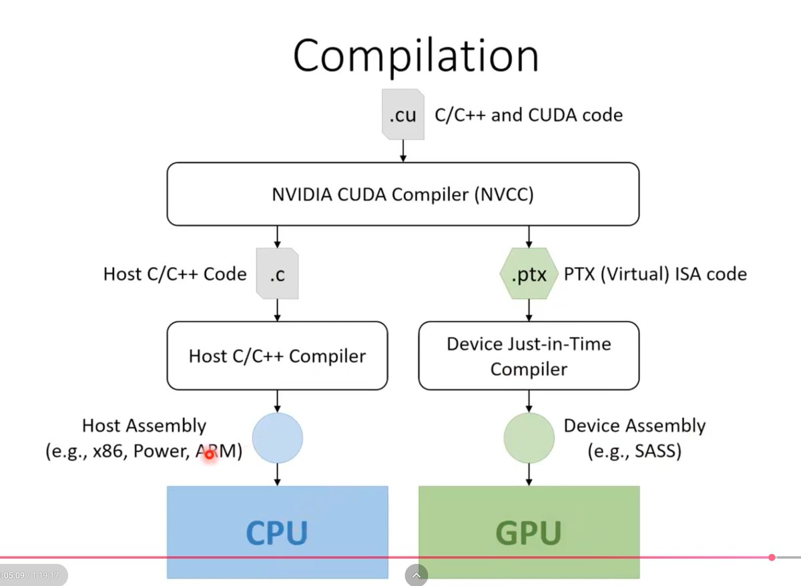

# CUDA (Compute Unified Device Architecture)编译链路总结：结合 a2a_dispatch_send.cu

## 一句话结论

这张图讲的是：同一个 .cu 文件会被 NVCC 拆成两条链路。
- 左边：Host 代码走 C/C++ 编译链，最终在 CPU 上执行，负责 launch kernel。
- 右边：Device 代码走 PTX/JIT/SASS 链，最终在 GPU 上执行，负责并行计算与数据搬运。

## 示例文件

- 源文件：[pplx-garden/p2p-all-to-all/a2a-kernels/src/a2a/a2a_dispatch_send.cu](pplx-garden/p2p-all-to-all/a2a-kernels/src/a2a/a2a_dispatch_send.cu)

## 图中每个框与代码的对应关系

### 1) .cu 输入（C/C++ + CUDA）

- 文件本身就是混合源码入口：[a2a_dispatch_send.cu](pplx-garden/p2p-all-to-all/a2a-kernels/src/a2a/a2a_dispatch_send.cu#L1)

### 2) NVIDIA CUDA Compiler (NVCC)

NVCC 会把同一份源码中的 Host 和 Device 部分拆开处理。

- Device 核函数定义（GPU 侧逻辑）：[__global__ a2a_dispatch_send_kernel](pplx-garden/p2p-all-to-all/a2a-kernels/src/a2a/a2a_dispatch_send.cu#L113)
- Host 侧封装与启动函数（CPU 侧逻辑）：[a2a_kernels::a2a_dispatch_send](pplx-garden/p2p-all-to-all/a2a-kernels/src/a2a/a2a_dispatch_send.cu#L539)

### 3) 左路径：Host C/C++ Code -> Host Compiler -> CPU

这条链路在本例中负责参数准备与 kernel 发射。

- 启动网格与线程块配置：[dim3 dimGrid / dimBlock](pplx-garden/p2p-all-to-all/a2a-kernels/src/a2a/a2a_dispatch_send.cu#L579)
- 组装 launch 参数：[void *args[]](pplx-garden/p2p-all-to-all/a2a-kernels/src/a2a/a2a_dispatch_send.cu#L591)
- 发射 cooperative kernel：[cudaLaunchCooperativeKernel 分支 1](pplx-garden/p2p-all-to-all/a2a-kernels/src/a2a/a2a_dispatch_send.cu#L639)
- 发射 cooperative kernel：[cudaLaunchCooperativeKernel 分支 2](pplx-garden/p2p-all-to-all/a2a-kernels/src/a2a/a2a_dispatch_send.cu#L655)

可以把 CPU 侧理解成调度员：决定怎么发车（grid/block），把参数打包后交给 GPU 执行。

### 4) 右路径：PTX (Virtual ISA) -> Device JIT -> Device Assembly (SASS) -> GPU

这条链路对应 kernel 体中实际并行执行的内容。图中虽然没展开代码细节，但在本例里主要表现为：

- 跨 block 协作句柄：[cooperative_groups::this_grid](pplx-garden/p2p-all-to-all/a2a-kernels/src/a2a/a2a_dispatch_send.cu#L155)
- 共享内存使用：[extern __shared__](pplx-garden/p2p-all-to-all/a2a-kernels/src/a2a/a2a_dispatch_send.cu#L158)
- 原子统计路由位置：[atomicAdd](pplx-garden/p2p-all-to-all/a2a-kernels/src/a2a/a2a_dispatch_send.cu#L189)
- 全网格同步：[grid.sync 第一次出现](pplx-garden/p2p-all-to-all/a2a-kernels/src/a2a/a2a_dispatch_send.cu#L261)
- 写 send buffer（发往对端）：[send_buffer 写入](pplx-garden/p2p-all-to-all/a2a-kernels/src/a2a/a2a_dispatch_send.cu#L316)
- 同节点直写 recv buffer（NVLink 路径）：[recv_ptrs 写入](pplx-garden/p2p-all-to-all/a2a-kernels/src/a2a/a2a_dispatch_send.cu#L307)

含义是：GPU 线程在 kernel 内完成 token 路由、偏移计算、buffer 写入和跨块同步；驱动会把 PTX 在运行时 JIT 成当前 GPU 对应的机器指令（SASS）后执行。

## 这个文件体现出的工程化要点

- 同一个业务逻辑被模板参数展开成多个 kernel 变体，按输入形状选择最匹配版本：
  [LAUNCH_TOKEN_DIM_DISPATCH](pplx-garden/p2p-all-to-all/a2a-kernels/src/a2a/a2a_dispatch_send.cu#L634)
- 因此图中抽象的一条 Device 链，在真实工程里通常对应多份特化后的 Device 代码。

## 小结

结合本例，图的核心可以落地为一句话：

CPU 侧代码在 Host 编译链中负责 launch，GPU 侧 kernel 在 Device 编译链中负责执行；NVCC 把两者从同一个 .cu 文件中拆分并连接起来。

## 逐条解读（原思路整理版）

这张图用 `a2a_dispatch_send.cu` 这个例子来对照非常合适。

图里每个框，对应这份代码可以这样看：

### 输入 .cu 源码

对应文件本身就是 .cu：
- [a2a_dispatch_send.cu:1](pplx-garden/p2p-all-to-all/a2a-kernels/src/a2a/a2a_dispatch_send.cu#L1)

### NVCC 前端“看见”同一个文件里同时有 Host 和 Device 代码

- Device 核函数定义在：
  [a2a_dispatch_send.cu:113](pplx-garden/p2p-all-to-all/a2a-kernels/src/a2a/a2a_dispatch_send.cu#L113)
- Host 侧启动函数在：
  [a2a_dispatch_send.cu:539](pplx-garden/p2p-all-to-all/a2a-kernels/src/a2a/a2a_dispatch_send.cu#L539)

### 图左边路径（Host C/C++ Code -> Host C/C++ Compiler -> CPU）

这条路径在代码里主要是“配置并发射 kernel”的部分：
- 组装启动维度：
  [a2a_dispatch_send.cu:579](pplx-garden/p2p-all-to-all/a2a-kernels/src/a2a/a2a_dispatch_send.cu#L579)
- 组装参数数组：
  [void *args[]](pplx-garden/p2p-all-to-all/a2a-kernels/src/a2a/a2a_dispatch_send.cu#L591)
- 调用 CUDA Runtime 发射 cooperative kernel：
  [a2a_dispatch_send.cu:639](pplx-garden/p2p-all-to-all/a2a-kernels/src/a2a/a2a_dispatch_send.cu#L639)
  [a2a_dispatch_send.cu:655](pplx-garden/p2p-all-to-all/a2a-kernels/src/a2a/a2a_dispatch_send.cu#L655)

可以把它理解为：CPU 端代码负责“调度员”工作，准备参数、决定 grid/block，然后下发给 GPU。

### 图右边路径（PTX -> Device JIT Compiler -> Device Assembly/SASS -> GPU）

这条路径对应核函数体内部真正跑在 GPU 上的逻辑：
- 线程块/网格协作：
  [a2a_dispatch_send.cu:155](pplx-garden/p2p-all-to-all/a2a-kernels/src/a2a/a2a_dispatch_send.cu#L155)
  [a2a_dispatch_send.cu:261](pplx-garden/p2p-all-to-all/a2a-kernels/src/a2a/a2a_dispatch_send.cu#L261)
- 共享内存和原子操作：
  [a2a_dispatch_send.cu:158](pplx-garden/p2p-all-to-all/a2a-kernels/src/a2a/a2a_dispatch_send.cu#L158)
  [a2a_dispatch_send.cu:189](pplx-garden/p2p-all-to-all/a2a-kernels/src/a2a/a2a_dispatch_send.cu#L189)
- 实际数据搬运到 send_buffer/recv_ptrs：
  [a2a_dispatch_send.cu:316](pplx-garden/p2p-all-to-all/a2a-kernels/src/a2a/a2a_dispatch_send.cu#L316)
  [a2a_dispatch_send.cu:307](pplx-garden/p2p-all-to-all/a2a-kernels/src/a2a/a2a_dispatch_send.cu#L307)

这部分会被编译成 GPU 可执行形式。图里画的是先到 PTX，再由驱动在运行时 JIT 到具体 GPU 指令（SASS）。

### 图外重点：模板分发会让 Device 代码产生多版本

看这里：
- [a2a_dispatch_send.cu:634](pplx-garden/p2p-all-to-all/a2a-kernels/src/a2a/a2a_dispatch_send.cu#L634)

这类宏会按 `token_dim`、`num_experts_per_token`、`node_size` 等维度分发模板参数，等价于“编译期生成多个 kernel 变体，运行时选一个最匹配的去 launch”。所以图里虽然只画一条 PTX 路，但实际工程里常常是“很多 PTX/机器码变体”。

### 一句话总结

同一个 .cu 文件里，Host 部分在 CPU 上做 launch 与编排，Device 部分在 GPU 上做并行路由与拷贝；NVCC 负责把两者拆分到各自编译链，最后在运行时由 CPU 发射到 GPU 执行。

我好奇英伟达在ptx, gpu isa, device jit, device sass以及nvcc里具体做了些什么神秘的事，你能把这些东西用简单的语言对一个初学者介绍清楚吗？

NVIDIA 的编译魔法：从 CUDA 代码到 GPU 执行
用一个比喻贯穿全程：你写了一份菜谱（CUDA 代码），最终变成厨师（GPU）能执行的动作指令。

整体流程一览

你写的 .cu 文件
      ↓  (nvcc 编译)
    PTX（虚拟汇编）
      ↓  (JIT 或 ptxas)
    SASS（真实机器码）
      ↓
    GPU 执行

1. nvcc — 编译总指挥
nvcc 是 NVIDIA 的编译器驱动，它本身不做全部编译，而是调度一堆工具：

把 .cu 文件里的 CPU 代码交给 gcc/clang
把 GPU 代码先编译成 PTX，再编译成 SASS
最后打包成一个可执行文件
类比：nvcc 是项目经理，它自己不写代码，负责协调各个工种。

2. PTX — 虚拟 GPU 汇编
PTX（Parallel Thread Execution）是 NVIDIA 发明的一种虚拟指令集。

为什么需要它？

NVIDIA 每代 GPU 架构不同（Volta、Ampere、Hopper...），真实指令也不同。如果 CUDA 代码直接编译成真实机器码，那每换一代 GPU 就要重新编译。

PTX 解决了这个问题：

PTX 是一种稳定的、与具体硬件无关的中间语言
类似 Java 的字节码，或 LLVM 的 IR
可读性强，长这样：

add.f32  %f3, %f1, %f2;   // 浮点加法
mul.lo.s32 %r3, %r1, %r2; // 整数乘法

类比：PTX 是通用菜谱，用普通人都看得懂的语言写，具体厨师（GPU）再翻译成自己的动作。

3. SASS — 真实 GPU 机器码
SASS（Shader ASSembly）是真正运行在 GPU 上的二进制指令，每一代架构都不同：

Ampere GPU 的 SASS 叫 SM80
Hopper GPU 的 SASS 叫 SM90
不同架构之间互不兼容
SASS 是最底层的东西，直接对应 GPU 的电路操作，人类很难直接读懂。可以用 cuobjdump --dump-sass 看到它。

类比：SASS 是厨师手册，写的是"第3秒抬起右手，以45度角切下"这种机器级动作。

4. GPU ISA — GPU 指令集架构
ISA（Instruction Set Architecture）就是"GPU 能理解哪些指令"的规范，SASS 就是基于 ISA 生成的。

NVIDIA 故意不完全公开 ISA（尤其是新架构），这是商业机密。每代新 GPU 出来，外界需要逆向工程才能搞清楚新指令的含义。

类比：ISA 是厨师能做哪些动作的能力清单，NVIDIA 自己知道完整清单，但不告诉你。

5. Device JIT — 运行时即时编译
JIT（Just-In-Time）编译发生在程序运行时：

场景：你的程序里存了 PTX 代码（而不是 SASS），当程序运行在某台机器上时，CUDA Driver 会把 PTX 实时编译成当前 GPU 的 SASS。

好处：

一份 PTX 可以在任何 NVIDIA GPU 上运行
新 GPU 出来了，老程序也能跑（JIT 会编译成新架构的 SASS）
坏处：

第一次运行有编译延迟（可能几秒到几十秒）
编译结果会缓存在 ~/.nv/ComputeCache/ 里
类比：JIT 是现场翻译，你带着通用菜谱（PTX）去任何厨房，翻译官现场把它翻译成这个厨房的专属动作手册（SASS）。

完整流程总结
阶段	      产物	     谁做的	             何时发生
编译 .cu	  PTX	       nvcc + cicc	     编译时
PTX → SASS	SASS	    ptxas 或 JIT	     编译时 或 运行时
打包	      fatbinary	 nvcc	             编译时
加载执行	   GPU 运行	  CUDA Driver + GPU	 运行时

一个实际小细节
nvcc 编译时可以同时嵌入两种东西：

nvcc -gencode arch=compute_80,code=sm_80  \  # 直接嵌入 SM80 的 SASS
     -gencode arch=compute_90,code=compute_90 \ # 嵌入 PTX 供 JIT 用
     mykernel.cu

这样程序在 A100（SM80）上用现成 SASS 跑，在更新的 GPU 上用 PTX JIT 编译后跑。

PTX和NVCC是英伟达的前台和餐厅，各个GPU的SSAS是英伟达的厨房重地。客人在前台和餐厅下单买单，厨房负责最后制作交货，但厨房制作细节概不对外开放。英伟达的好生意模式，既不影响服务顾客，又能保守商业秘密。

这个比喻非常贴切。补充一点让它更完整：

PTX 还充当了"通用菜单"的角色 —— 不管你是哪里来的顾客（哪代 GPU），菜单永远能看懂、永远能点。但进了厨房之后，A100 的灶台和 H100 的灶台完全不同，顾客无从知晓。

这个设计有一个深层的商业意图：让开发者深度绑定 CUDA 生态。你写的代码依赖 PTX 这套语言体系，换成 AMD 或 Intel GPU 就得重写——这就是护城河。开放前台（PTX 文档完整公开），锁死厨房（SASS/ISA 不公开），是一套相当精明的"开放式封闭"策略。

