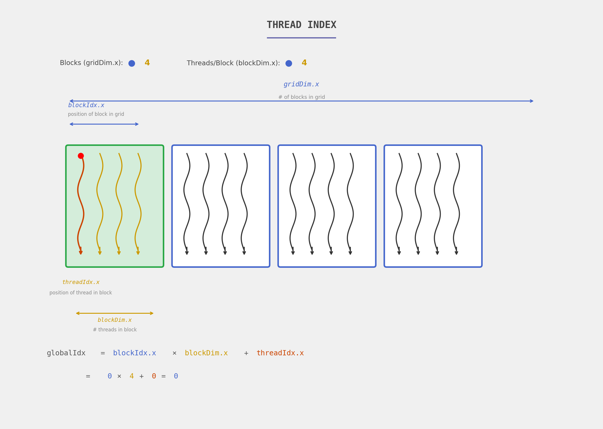
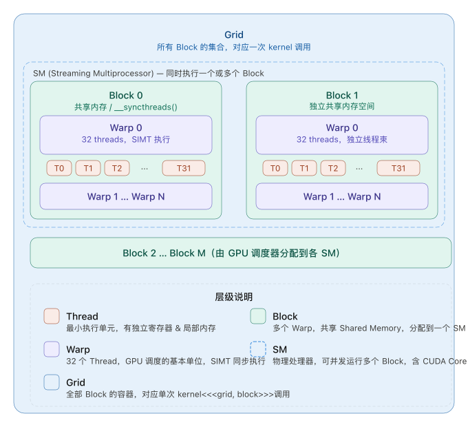

# CUDA 线程索引可视化解释

> 来源：[@levidiamode](https://x.com/levidiamode/status/2007167991075713262) — 365天GPU编程挑战 Day 2




---

## 图中结构

整个图展示了一个 **1D CUDA 线程层次结构**：
- **4 个 Block**（蓝框），对应 `gridDim.x = 4`
- **每个 Block 有 4 个 Thread**（波浪箭头），对应 `blockDim.x = 4`
- 第一个 Block 被绿色高亮，其中第一个 Thread 被橙色高亮（红点）

---

## 四个关键变量

| 变量 | 含义 | 图中当前值 |
|------|------|-----------|
| `gridDim.x` | Grid 中 Block 的总数 | 4 |
| `blockIdx.x` | 当前 Block 在 Grid 中的位置 | 0 |
| `blockDim.x` | 每个 Block 中 Thread 的数量 | 4 |
| `threadIdx.x` | 当前 Thread 在 Block 中的位置 | 0 |

---

## 核心公式

```
globalIdx = blockIdx.x × blockDim.x + threadIdx.x
          = 0 × 4 + 0
          = 0
```

## 直觉理解

就像门牌号：
- 你在第 `blockIdx.x` 栋楼
- 每栋楼有 `blockDim.x` 个房间
- 你住第 `threadIdx.x` 间
- 全局编号 = 楼号 × 每栋楼房间数 + 房间号

**举例：** 第 2 个 Block 的第 3 个 Thread → `2 × 4 + 3 = 11`

---

## CUDA 代码中的用法

```cuda
__global__ void myKernel(float* data) {
    int globalIdx = blockIdx.x * blockDim.x + threadIdx.x;
    // 每个线程处理 data[globalIdx]
    data[globalIdx] = ...;
}

// 启动：4个Block，每个Block 4个Thread
myKernel<<<4, 4>>>(data);
```

---

---

# NVIDIA 的编译魔法：从 CUDA 代码到 GPU 执行

用一个比喻贯穿全程：**你写了一份菜谱（CUDA 代码），最终变成厨师（GPU）能执行的动作指令**。

---

## 整体流程一览

```
你写的 .cu 文件
      ↓  (nvcc 编译)
    PTX（虚拟汇编）
      ↓  (JIT 或 ptxas)
    SASS（真实机器码）
      ↓
    GPU 执行
```

---

## 1. `nvcc` — 编译总指挥

`nvcc` 是 NVIDIA 的编译器驱动，**它本身不做全部编译，而是调度一堆工具**：

- 把 `.cu` 文件里的 CPU 代码交给 `gcc/clang`
- 把 GPU 代码先编译成 PTX，再编译成 SASS
- 最后打包成一个可执行文件

类比：nvcc 是**项目经理**，它自己不写代码，负责协调各个工种。

---

## 2. PTX — 虚拟 GPU 汇编

PTX（Parallel Thread Execution）是 NVIDIA 发明的一种**虚拟指令集**。

**为什么需要它？**

NVIDIA 每代 GPU 架构不同（Volta、Ampere、Hopper...），真实指令也不同。如果 CUDA 代码直接编译成真实机器码，那每换一代 GPU 就要重新编译。

PTX 解决了这个问题：

- PTX 是一种**稳定的、与具体硬件无关的中间语言**
- 类似 Java 的字节码，或 LLVM 的 IR
- 可读性强，长这样：

```ptx
add.f32  %f3, %f1, %f2;   // 浮点加法
mul.lo.s32 %r3, %r1, %r2; // 整数乘法
```

类比：PTX 是**通用菜谱**，用普通人都看得懂的语言写，具体厨师（GPU）再翻译成自己的动作。

---

## 3. SASS — 真实 GPU 机器码

SASS（Shader ASSembly）是**真正运行在 GPU 上的二进制指令**，每一代架构都不同：

- Ampere GPU 的 SASS 叫 SM80
- Hopper GPU 的 SASS 叫 SM90
- 不同架构之间**互不兼容**

SASS 是最底层的东西，直接对应 GPU 的电路操作，人类很难直接读懂。可以用 `cuobjdump --dump-sass` 看到它。

类比：SASS 是**厨师手册**，写的是"第3秒抬起右手，以45度角切下"这种机器级动作。

---

## 4. GPU ISA — GPU 指令集架构

ISA（Instruction Set Architecture）就是"GPU 能理解哪些指令"的规范，SASS 就是基于 ISA 生成的。

NVIDIA **故意不完全公开 ISA**（尤其是新架构），这是商业机密。每代新 GPU 出来，外界需要逆向工程才能搞清楚新指令的含义。

类比：ISA 是**厨师能做哪些动作的能力清单**，NVIDIA 自己知道完整清单，但不告诉你。

---

## 5. Device JIT — 运行时即时编译

JIT（Just-In-Time）编译发生在**程序运行时**：

**场景**：你的程序里存了 PTX 代码（而不是 SASS），当程序运行在某台机器上时，CUDA Driver 会把 PTX **实时编译**成当前 GPU 的 SASS。

**好处**：
- 一份 PTX 可以在任何 NVIDIA GPU 上运行
- 新 GPU 出来了，老程序也能跑（JIT 会编译成新架构的 SASS）

**坏处**：
- 第一次运行有编译延迟（可能几秒到几十秒）
- 编译结果会缓存在 `~/.nv/ComputeCache/` 里

类比：JIT 是**现场翻译**，你带着通用菜谱（PTX）去任何厨房，翻译官现场把它翻译成这个厨房的专属动作手册（SASS）。

---

## 完整流程总结

| 阶段 | 产物 | 谁做的 | 何时发生 |
|------|------|--------|---------|
| 编译 `.cu` | PTX | nvcc + cicc | 编译时 |
| PTX → SASS | SASS | ptxas 或 JIT | 编译时 或 运行时 |
| 打包 | fatbinary | nvcc | 编译时 |
| 加载执行 | GPU 运行 | CUDA Driver + GPU | 运行时 |

---

## 实际编译示例

`nvcc` 编译时可以同时嵌入两种东西：

```bash
nvcc -gencode arch=compute_80,code=sm_80      \  # 直接嵌入 SM80 的 SASS
     -gencode arch=compute_90,code=compute_90 \  # 嵌入 PTX 供 JIT 用
     mykernel.cu
```

这样程序在 A100（SM80）上用现成 SASS 跑，在更新的 GPU 上用 PTX JIT 编译后跑。
